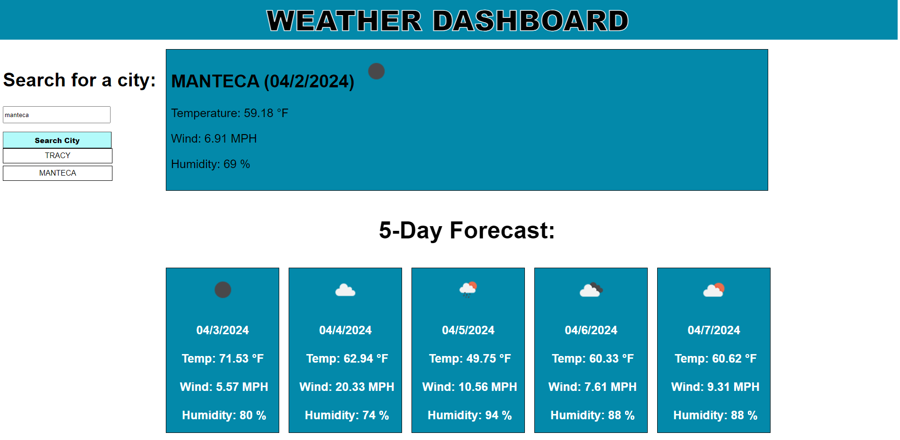

# Weather-Dashboard-API-Challenge
* This application presents a weather dashboard that uses weather map API to show current's date weather condition.
* It contains a text area where user can enter the city name and upon clicking on the search button will be presented by current weather condition including the temperature, humidity and wind. 
* The user will also be able to view the next five day forecast for the city entered.
* Current weather and forecast also contains icons that represents the weather.
* Every city entered will be added to history where user can click and again be presented with current and forecast weather conditions.
* Searched city history will remain even after refreshing the page.

* Link to the deployed application: https://jenina52112.github.io/Weather-Dashboard-API-Challenge/
